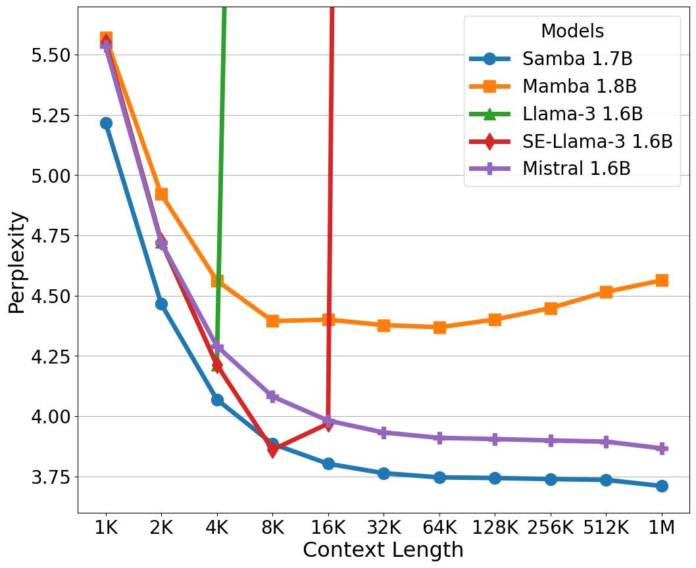
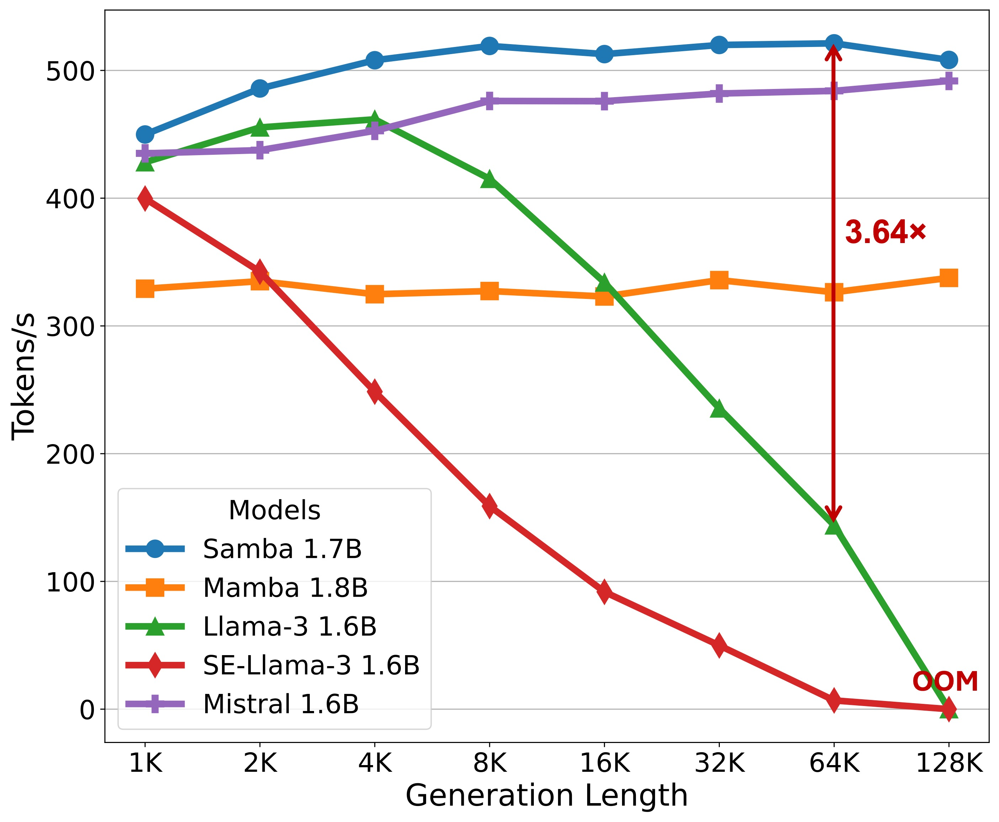

<div align="center">
  
</div>


<h1 align="left"> Samba: Simple Hybrid State Space Models for Efficient Unlimited Context Language Modeling</h1>

[](https://arxiv.org/abs/2406.07522)


Samba is a simple yet powerful hybrid model with an **unlimited** context length. Its architecture is frustratingly simple: 

Samba = Mamba + MLP + Sliding Window Attention + MLP stacking at the layer level.

Our largest model, `Samba-3.8B`, is trained on 3.2 trillion tokens from the Phi3 dataset, outperforming `Phi3-mini` on major benchmarks (e.g. MMLU, GSM8K and HumanEval) by a large margin. Samba can also achieve perfect **long-context** retrieval ability with minimal instruction tuning, while still maintaining its **linear complexity** with respect to sequence length. This ability leads to the impressive performance of `Samba-3.8B-instruct` on downstream tasks such as long-context summarization. 


## Performance :rocket:
<div align="left">
  
  
</div>


| Model                         | MMLU | GSM8K | HumanEval | GovReport | SQuALITY |
|-------------------------------|------|-------|-----------|-----------|----------|
| Phi-3-mini-4K-instruct   | 68.8 | 82.5  | 58.5      | 14.4      | 21.6     |
| Samba-3.8B-instruct (preview)       | **71.9** | **87.6** | **62.8**      | **18.9**      | 21.2     |

We report 5-shot accuracy for MMLU, 8-shot CoT accuracy for GSM8K, 0-shot pass@1 for HumanEval and ROUGE-L for both GovReport and SQuALITY.
## Updates
- [June 11] Released the codebase for training Samba-421M and Samba-1.3B on SlimPajama. 


## Code Overview
Our training infrastructure on SlimPajama is a modified version of [TinyLlama](https://github.com/jzhang38/TinyLlama) and [LitGPT](https://github.com/Lightning-AI/litgpt). One can easily specify different architectual configurations through modifying the [`model_name`](pretrain.py#L30) and the [`config file`](lit_gpt/config.py) which includes tons of baseline architectures mentioned in the paper. Our RetNet and GLA implementations are from the awesome [Flash Linear Attention](https://github.com/sustcsonglin/flash-linear-attention) repository.


## Pretraining Samba from scratch
Please follow the [`Dockerfile`](Dockerfile) to setup the environment. The data preparation mainly follows TinyLlama except that we only use the SlimPajama dataset.

### Data Preparation

Download the Slimpajama dataset to your chosen directory.
```bash
cd /path/to/dataset
git lfs install
git clone https://huggingface.co/datasets/cerebras/SlimPajama-627B
```
The SlimPajama dataset takes 893GB diskspace. Use the provided scripts to tokenize the datasets and divide them into chunks.
```bash
python scripts/prepare_slimpajama.py --source_path /path/to/SlimPajama --tokenizer_path data/llama  --destination_path data/slim --split validation --percentage 1.0
python scripts/prepare_slimpajama.py --source_path /path/to/SlimPajama --tokenizer_path data/llama  --destination_path data/slim --split train --percentage 1.0
```
You are now ready to launch a job!

### Training
The following script trains a default Samba-421M model on a single node of 8 GPUs with 20B tokens.
```bash
torchrun --nnodes=1 --nproc_per_node=8 --rdzv_id=samba-421M --rdzv_backend=c10d  --rdzv_endpoint=${MASTER_ADDR}:${MASTER_PORT} pretrain.py --train_data_dir data/slim --val_data_dir data/slim 
```
You can modify [`model_name`](pretrain.py#L33) to "Samba_1.3B" and [`train_config`](pretrain.py#L34) to "tsz512x4k_100B" for training a Samba-1.3B model with 100B tokens. We assume that you have 8 nodes each with 8 GPUs, and you can modify the number of [`nodes`](pretrain.py#L43) for training on fewer gpus.


## Citation

If you find our work useful, please consider citing:

```bibtex
@article{ren2024samba,
      title={Samba: Simple Hybrid State Space Models for Efficient Unlimited Context Language Modeling}, 
      author={Liliang Ren and Yang Liu and Yadong Lu and Yelong Shen and Chen Liang and Weizhu Chen},
      journal = {arXiv preprint},
      year={2024},
      url={https://arxiv.org/abs/2406.07522}
}
```

## Contact

Liliang Ren (liliangren@microsoft.com)
